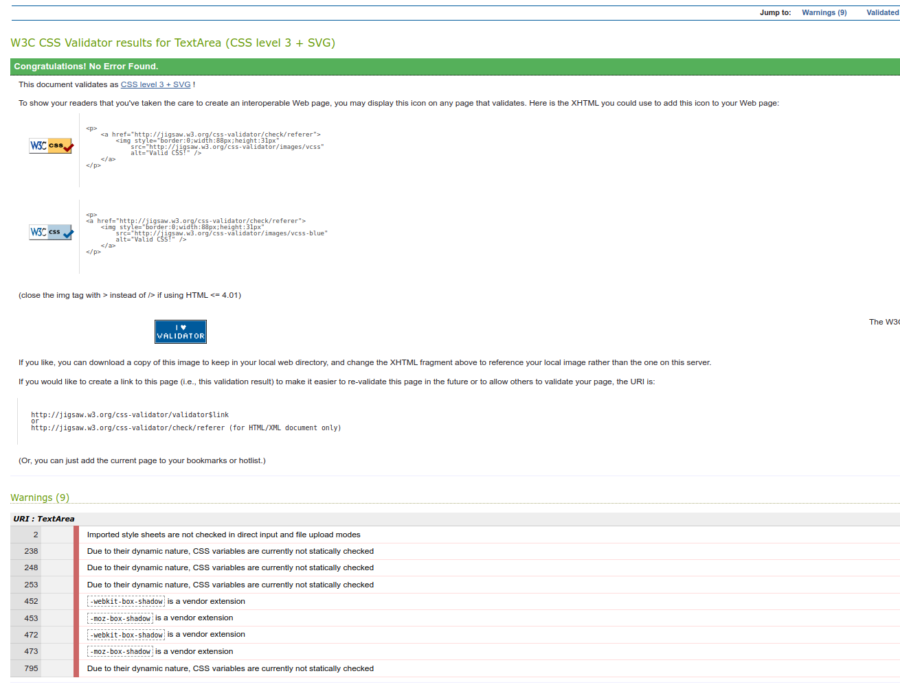

# 

# Testing

  * [PEP8 Validator]()
  * [W3C Validator]()
  * [JavaScript Validator]()
  * [Solved Bugs]()
  * [Known Bugs]()
  * [Testing User Stories]()
  * [Lighthouse]()
  * [Full Testing]()

Testing was ongoing throughout the entire build. We utilised Chrome developer tools while building to pinpoint and troubleshoot any issues as we went along.

### PEP8 Validator

### CSS Validator

The CSS on the site was tested using the [Jigsaw W3C CSS Validator](https://jigsaw.w3.org/css-validator/). No errors were found. There were 9 warnings regarding css variables and webkit prefixes. However, the site was perfectly functional.

### JavaScript Validator

### Solved Bugs

* 

### Known Bugs

* There is a known bug where users can click Enter and send blank messages. Due to time constraints on this project, we were unable to fix this before final deployment but intend on doing so in a future update.

### Testing User Stories

* First Time Visitors

* Returning Visitors

* Frequent Visitors

### Lighthouse

We used Lighthouse within the Chrome Developer Tools to test the performance, accessibility, best practices and SEO of the website.

### Full Testing